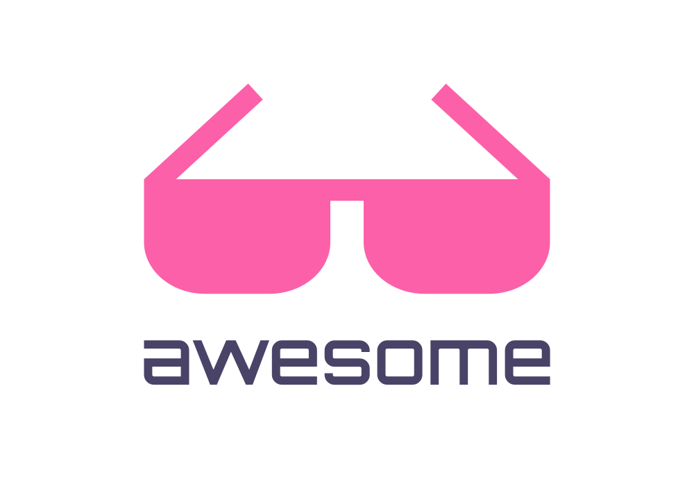

	
	 
	 
	 
    A  list of awesome things to read & learn - Ruben

 

## Contents

- [Platforms](#platforms)
- [Programming Languages](#programming-languages)
- [Front-End Development](#front-end-development)
- [Back-End Development](#back-end-development)
- [Theory](#theory)
- [Books](#books)
- [Editors](#editors)
- [Development Environment](#development-environment)
- [Entertainment](#entertainment)
- [Databases](#databases)
- [Media](#media)
- [Learn](#learn)
- [Security](#security)
- [Content Management Systems](#content-management-systems)
- [Hardware](#hardware)
- [Business](#business)
- [Work](#work)
- [Networking](#networking)
- [Higher Education](#higher-education)
- [Miscellaneous](#miscellaneous)
- [Related](#related)

## Platforms

- [Node.js](https://github.com/sindresorhus/awesome-nodejs#readme) - Async non-blocking event-driven JavaScript runtime built on Chrome's V8 JavaScript engine. - [Cross-Platform](https://github.com/bcoe/awesome-cross-platform-nodejs#readme) - Writing cross-platform code on Node.js.
- [Frontend Development](https://github.com/dypsilon/frontend-dev-bookmarks#readme)
- [IoT & Hybrid Apps](https://github.com/weblancaster/awesome-IoT-hybrid#readme)
- [Electron](https://github.com/sindresorhus/awesome-electron#readme) - Cross-platform native desktop apps using JavaScript/HTML/CSS.
- [React Native](https://github.com/jondot/awesome-react-native#readme) - JavaScript framework for writing natively rendering mobile apps for iOS and Android.
- [Linux](https://github.com/aleksandar-todorovic/awesome-linux#readme) - [Containers](https://github.com/Friz-zy/awesome-linux-containers#readme) - [eBPF](https://github.com/zoidbergwill/awesome-ebpf#readme) - Virtual machine that allows you to write more efficient and powerful tracing and monitoring for Linux systems.
- [macOS](https://github.com/iCHAIT/awesome-macOS#readme) - Operating system for Apple's Mac computers. - [Command-Line](https://github.com/herrbischoff/awesome-macos-command-line#readme) - [Screensavers](https://github.com/agarrharr/awesome-macos-screensavers#readme) - [Apps](https://github.com/jaywcjlove/awesome-mac#readme) - [Open Source Apps](https://github.com/serhii-londar/
- [JVM](https://github.com/deephacks/awesome-jvm#readme)
- [Amazon Web Services](https://github.com/donnemartin/awesome-aws#readme)
- [Heroku](https://github.com/ianstormtaylor/awesome-heroku#readme) - Cloud platform as a service.
- [Raspberry Pi](https://github.com/thibmaek/awesome-raspberry-pi#readme) - Credit card-sized computer aimed at teaching kids programming, but capable of a lot more.
- [WebExtensions](https://github.com/fregante/Awesome-WebExtensions#readme) - Cross-browser extension system.
- [Smart TV](https://github.com/vitalets/awesome-smart-tv#readme) - Create apps for different TV platforms.
- [Amazon Alexa](https://github.com/miguelmota/awesome-amazon-alexa#readme) - Virtual home assistant.
- [DigitalOcean](https://github.com/jonleibowitz/awesome-digitalocean#readme) - Cloud computing platform designed for developers.
- [Flutter](https://github.com/Solido/awesome-flutter#readme) - Google's mobile SDK for building native iOS and Android apps from a single codebase written in Dart.
- [Home Assistant](https://github.com/frenck/awesome-home-assistant#readme) - Open source home automation that puts local control and privacy first.
- [IBM Cloud](https://github.com/victorshinya/awesome-ibmcloud#readme) - Cloud platform for developers and companies.
- [Firebase](https://github.com/jthegedus/awesome-firebase#readme) - App development platform built on Google Cloud Platform.
- [Robot Operating System 2.0](https://github.com/fkromer/awesome-ros2#readme) - Set of software libraries and tools that help you build robot apps.
- [Adafruit IO](https://github.com/adafruit/awesome-adafruitio#readme) - Visualize and store data from any device.
- [Cloudflare](https://github.com/irazasyed/awesome-cloudflare#readme) - CDN, DNS, DDoS protection, and security for your site.
- [Actions on Google](https://github.com/ravirupareliya/awesome-actions-on-google#readme) - Developer platform for Google Assistant.

## Programming Languages

- [JavaScript](https://github.com/sorrycc/awesome-javascript#readme) - [Promises](https://github.com/wbinnssmith/awesome-promises#readme) - [Standard Style](https://github.com/standard/awesome-standard#readme) - Style guide and linter. - [Must Watch Talks](https://github.com/bolshchikov/js-must-watch#readme) - [Tips](https://github.com/loverajoel/jstips#readme) - [Network Layer](https://github.com/Kikobeats/awesome-network-js#readme) - [Micro npm Packages](https://github.com/parro-it/awesome-micro-npm-packages#readme) - [Mad Science npm Packages](https://github.com/feross/awesome-mad-science#readme) - Impossible sounding projects that exist. - [Maintenance Modules](https://github.com/maxogden/maintenance-modules#readme) - For npm packages. - [npm](https://github.com/sindresorhus/awesome-npm#readme) - Package manager. - [AVA](https://github.com/avajs/awesome-ava#readme) - Test runner. - [ESLint](https://github.com/dustinspecker/awesome-eslint#readme) - Linter. - [Functional Programming](https://github.com/stoeffel/awesome-fp-js#readme) - [Observables](https://github.com/sindresorhus/awesome-observables#readme) - [npm scripts](https://github.com/RyanZim/awesome-npm-scripts#readme) - Task runner. - [30 Seconds of Code](https://github.com/30-seconds/30-seconds-of-code#readme) - Code snippets you can understand in 30 seconds.
- [Python](https://github.com/vinta/awesome-python#readme) - General-purpose programming language designed for readability. - [Asyncio](https://github.com/timofurrer/awesome-asyncio#readme) - Asynchronous I/O in Python 3. - [Scientific Audio](https://github.com/faroit/awesome-python-scientific-audio#readme) - Scientific research in audio/music. - [CircuitPython](https://github.com/adafruit/awesome-circuitpython#readme) - A version of Python for microcontrollers. - [Data Science](https://github.com/krzjoa/awesome-python-data-science#readme) - Data analysis and machine learning.
- [PureScript](https://github.com/passy/awesome-purescript#readme)
- [Go](https://github.com/avelino/awesome-go#readme)
- [Elixir](https://github.com/h4cc/awesome-elixir#readme)
- [Elm](https://github.com/sporto/awesome-elm#readme)

## Front-End Development

- [ES6 Tools](https://github.com/addyosmani/es6-tools#readme)
- [Web Performance Optimization](https://github.com/davidsonfellipe/awesome-wpo#readme)
- [Web Tools](https://github.com/lvwzhen/tools#readme)
- [CSS](https://github.com/awesome-css-group/awesome-css#readme) - Style sheet language that specifies how HTML elements are displayed on screen. - [Critical-Path Tools](https://github.com/addyosmani/critical-path-css-tools#readme) - [Scalability](https://github.com/davidtheclark/scalable-css-reading-list#readme) - [Must-Watch Talks](https://github.com/AllThingsSmitty/must-watch-css#readme) - [Protips](https://github.com/AllThingsSmitty/css-protips#readme) - [Frameworks](https://github.com/troxler/awesome-css-frameworks#readme)
- [React](https://github.com/enaqx/awesome-react#readme) - App framework. - [Relay](https://github.com/expede/awesome-relay#readme) - Framework for building data-driven React apps. - [React Hooks](https://github.com/glauberfc/awesome-react-hooks#readme) - A new feature that lets you use state and other React features without writing a class.
- [Web Components](https://github.com/mateusortiz/webcomponents-the-right-way#readme)
- [Polymer](https://github.com/Granze/awesome-polymer#readme) - JavaScript library to develop Web Components.
- [Angular](https://github.com/PatrickJS/awesome-angular#readme) - App framework.
- [Backbone](https://github.com/sadcitizen/awesome-backbone#readme) - App framework.
- [HTML5](https://github.com/diegocard/awesome-html5#readme) - Markup language used for websites & web apps.
- [SVG](https://github.com/willianjusten/awesome-svg#readme) - XML-based vector image format.
- [Canvas](https://github.com/raphamorim/awesome-canvas#readme)
- [KnockoutJS](https://github.com/dnbard/awesome-knockout#readme) - JavaScript library.
- [Dojo Toolkit](https://github.com/petk/awesome-dojo#readme) - JavaScript toolkit.
- [Inspiration](https://github.com/NoahBuscher/Inspire#readme)
- [Ember](https://github.com/ember-community-russia/awesome-ember#readme) - App framework.
- [Meteor](https://github.com/Urigo/awesome-meteor#readme)
- [BEM](https://github.com/sturobson/BEM-resources#readme)
- [Flexbox](https://github.com/afonsopacifer/awesome-flexbox#readme)
- [Web Typography](https://github.com/deanhume/typography#readme)
- [Web Accessibility](https://github.com/brunopulis/awesome-a11y#readme)
- [Material Design](https://github.com/sachin1092/awesome-material#readme)
- [D3](https://github.com/wbkd/awesome-d3#readme) - Library for producing dynamic, interactive data visualizations.
- [Emails](https://github.com/jonathandion/awesome-emails#readme)
- [Web Audio](https://github.com/notthetup/awesome-webaudio#readme)
- [Offline-First](https://github.com/pazguille/offline-first#readme)
- [Static Website Services](https://github.com/agarrharr/awesome-static-website-services#readme)
- [Cycle.js](https://github.com/cyclejs-community/awesome-cyclejs#readme) - Functional and reactive JavaScript framework.
- [Text Editing](https://github.com/dok/awesome-text-editing#readme)
- [Motion UI Design](https://github.com/fliptheweb/motion-ui-design#readme)
- [Vue.js](https://github.com/vuejs/awesome-vue#readme) - App framework.
- [Marionette.js](https://github.com/sadcitizen/awesome-marionette#readme) - App framework.
- [Aurelia](https://github.com/aurelia-contrib/awesome-aurelia#readme) - App framework.
- [Charting](https://github.com/zingchart/awesome-charting#readme)
- [Ionic Framework 2](https://github.com/candelibas/awesome-ionic#readme)
- [Chrome DevTools](https://github.com/ChromeDevTools/awesome-chrome-devtools#readme)
- [PostCSS](https://github.com/jdrgomes/awesome-postcss#readme) - CSS tool.
- [Draft.js](https://github.com/nikgraf/awesome-draft-js#readme) - Rich text editor framework for React.
- [Service Workers](https://github.com/TalAter/awesome-service-workers#readme)
- [Progressive Web Apps](https://github.com/TalAter/awesome-progressive-web-apps#readme)
- [choo](https://github.com/choojs/awesome-choo#readme) - App framework.
- [Redux](https://github.com/brillout/awesome-redux#readme) - State container for JavaScript apps.
- [webpack](https://github.com/webpack-contrib/awesome-webpack#readme) - Module bundler.
- [Browserify](https://github.com/browserify/awesome-browserify#readme) - Module bundler.
- [Sass](https://github.com/Famolus/awesome-sass#readme) - CSS preprocessor.
- [Ant Design](https://github.com/websemantics/awesome-ant-design#readme) - Enterprise-class UI design language.
- [Less](https://github.com/LucasBassetti/awesome-less#readme) - CSS preprocessor.
- [Progressive Enhancement](https://github.com/jbmoelker/progressive-enhancement-resources#readme)
- [Next.js](https://github.com/unicodeveloper/awesome-nextjs#readme) - Framework for server-rendered React apps.
- [Hyperapp](https://github.com/jorgebucaran/awesome-hyperapp#readme) - Tiny JavaScript library for building web apps.
- [lit-html](https://github.com/web-padawan/awesome-lit-html#readme) - HTML templating library for JavaScript.
- [JAMstack](https://github.com/automata/awesome-jamstack#readme) - Modern web development architecture based on client-side JavaScript, reusable APIs, and prebuilt markup.
- [Headless CMS](https://headlesscms.org/) - A List of Content Management Systems for JAMstack Sites
- [Mobile Web Development](https://github.com/myshov/awesome-mobile-web-development#readme) - Creating a great mobile web experience.
- [Storybook](https://github.com/lauthieb/awesome-storybook#readme) - Development environment for UI components..
- [Web Performance Metrics](https://github.com/csabapalfi/awesome-web-performance-metrics#readme) - Metrics to help understand page speed and user experience.

## Back-End Development

- [Flask](https://github.com/humiaozuzu/awesome-flask#readme) - Python framework.
- [Docker](https://github.com/veggiemonk/awesome-docker#readme)
- [Vagrant](https://github.com/iJackUA/awesome-vagrant#readme) - Automation virtual machine environment.
- [Pyramid](https://github.com/uralbash/awesome-pyramid#readme) - Python framework.
- [Play1 Framework](https://github.com/PerfectCarl/awesome-play1#readme)
- [Useful `.htaccess` Snippets](https://github.com/phanan/htaccess#readme)
- [nginx](https://github.com/fcambus/nginx-resources#readme) - Web server.
- [Kubernetes](https://github.com/ramitsurana/awesome-kubernetes#readme) - Open-source platform that automates Linux container operations.
- [Serverless Framework](https://github.com/pmuens/awesome-serverless#readme) - Serverless computing and serverless architectures.
- [Terraform](https://github.com/shuaibiyy/awesome-terraform#readme) - Tool for building, changing, and versioning infrastructure.
- [Dash](https://github.com/ucg8j/awesome-dash#readme) - Python web app framework.

## Theory

- [Talks](https://github.com/JanVanRyswyck/awesome-talks#readme)
- [Algorithms](https://github.com/tayllan/awesome-algorithms#readme) - [Education](https://github.com/gaerae/awesome-algorithms-education#readme) - Learning and practicing.
- [Algorithm Visualizations](https://github.com/enjalot/algovis#readme)
- [Artificial Intelligence](https://github.com/owainlewis/awesome-artificial-intelligence#readme)
- [Search Engine Optimization](https://github.com/marcobiedermann/search-engine-optimization#readme)
- [Competitive Programming](https://github.com/lnishan/awesome-competitive-programming#readme)
- [Math](https://github.com/rossant/awesome-math#readme)
- [Recursion Schemes](https://github.com/passy/awesome-recursion-schemes#readme) - Traversing nested data structures.

## Books

- [Free Programming Books](https://github.com/EbookFoundation/free-programming-books#readme)
- [Free Software Testing Books](https://github.com/ligurio/awesome-software-quality#readme)
- [Go Books](https://github.com/dariubs/GoBooks#readme)
- [Mind Expanding Books](https://github.com/hackerkid/Mind-Expanding-Books#readme)
- [Book Authoring](https://github.com/TalAter/awesome-book-authoring#readme)
- [Elixir Books](https://github.com/sger/ElixirBooks#readme)

## Editors

- [Visual Studio Code](https://github.com/viatsko/awesome-vscode#readme) - Cross-platform open-source text editor.

## Development Environment

- [Quick Look Plugins](https://github.com/sindresorhus/quick-look-plugins#readme) - For macOS.
- [Dev Env](https://github.com/jondot/awesome-devenv#readme)
- [Dotfiles](https://github.com/webpro/awesome-dotfiles#readme)
- [Shell](https://github.com/alebcay/awesome-shell#readme)
- [Fish](https://github.com/jorgebucaran/awesome-fish#readme) - User-friendly shell.
- [Command-Line Apps](https://github.com/agarrharr/awesome-cli-apps#readme)
- [ZSH Plugins](https://github.com/unixorn/awesome-zsh-plugins#readme)
- [GitHub](https://github.com/phillipadsmith/awesome-github#readme) - Hosting service for Git repositories. - [Browser Extensions](https://github.com/stefanbuck/awesome-browser-extensions-for-github#readme) - [Cheat Sheet](https://github.com/tiimgreen/github-cheat-sheet#readme) - [Pinned Gists](https://github.com/matchai/awesome-pinned-gists#readme) - Dynamic pinned gists for your GitHub profile.
- [Git Cheat Sheet & Git Flow](https://github.com/arslanbilal/git-cheat-sheet#readme)
- [Git Tips](https://github.com/git-tips/tips#readme)
- [Git Add-ons](https://github.com/stevemao/awesome-git-addons#readme) - Enhance the `git` CLI.
- [Git Hooks](https://github.com/compscilauren/awesome-git-hooks#readme) - Scripts for automating tasks during `git` workflows.
- [SSH](https://github.com/moul/awesome-ssh#readme)
- [FOSS for Developers](https://github.com/tvvocold/FOSS-for-Dev#readme)
- [Hyper](https://github.com/bnb/awesome-hyper#readme) - Cross-platform terminal app built on web technologies.
- [PowerShell](https://github.com/janikvonrotz/awesome-powershell#readme) - Cross-platform object-oriented shell.
- [Alfred Workflows](https://github.com/derimagia/awesome-alfred-workflows#readme) - Productivity app for macOS.
- [Terminals Are Sexy](https://github.com/k4m4/terminals-are-sexy#readme)

## Entertainment

- [Science Fiction](https://github.com/sindresorhus/awesome-scifi#readme) - Scifi.
- [Fantasy](https://github.com/RichardLitt/awesome-fantasy#readme)
- [Podcasts](https://github.com/ayr-ton/awesome-geek-podcasts#readme)
- [Email Newsletters](https://github.com/zudochkin/awesome-newsletters#readme)
- [IT Quotes](https://github.com/victorlaerte/awesome-it-quotes#readme)

## Databases

- [Database](https://github.com/numetriclabz/awesome-db#readme)
- [MySQL](https://github.com/shlomi-noach/awesome-mysql#readme)
- [SQLAlchemy](https://github.com/dahlia/awesome-sqlalchemy#readme)
- [InfluxDB](https://github.com/mark-rushakoff/awesome-influxdb#readme)
- [Neo4j](https://github.com/neueda/awesome-neo4j#readme)
- [MongoDB](https://github.com/ramnes/awesome-mongodb#readme) - NoSQL database.
- [RethinkDB](https://github.com/d3viant0ne/awesome-rethinkdb#readme)
- [TinkerPop](https://github.com/mohataher/awesome-tinkerpop#readme) - Graph computing framework.
- [PostgreSQL](https://github.com/dhamaniasad/awesome-postgres#readme) - Object-relational database.
- [CouchDB](https://github.com/quangv/awesome-couchdb#readme) - Document-oriented NoSQL database.
- [HBase](https://github.com/rayokota/awesome-hbase#readme) - Distributed, scalable, big data store.
- [NoSQL Guides](https://github.com/erictleung/awesome-nosql-guides#readme) - Help on using non-relational, distributed, open-source, and horizontally scalable databases.

## Media

- [Creative Commons Media](https://github.com/shime/creative-commons-media#readme)
- [Fonts](https://github.com/brabadu/awesome-fonts#readme)
- [Codeface](https://github.com/chrissimpkins/codeface#readme) - Text editor fonts.
- [Stock Resources](https://github.com/neutraltone/awesome-stock-resources#readme)
- [GIF](https://github.com/davisonio/awesome-gif#readme) - Image format known for animated images.
- [Music](https://github.com/ciconia/awesome-music#readme)
- [Open Source Documents](https://github.com/hubtee/awesome-opensource-documents#readme)
- [Audio Visualization](https://github.com/willianjusten/awesome-audio-visualization#readme)
- [Broadcasting](https://github.com/ebu/awesome-broadcasting#readme)
- [Pixel Art](https://github.com/Siilwyn/awesome-pixel-art#readme) - Pixel-level digital art.
- [FFmpeg](https://github.com/transitive-bullshit/awesome-ffmpeg#readme) - Cross-platform solution to record, convert and stream audio and video.
- [Icons](https://github.com/notlmn/awesome-icons#readme) - Downloadable SVG/PNG/font icon projects.

## Learn

- [CLI Workshoppers](https://github.com/therebelrobot/awesome-workshopper#readme) - Interactive tutorials.
- [Learn to Program](https://github.com/karlhorky/learn-to-program#readme)
- [Speaking](https://github.com/matteofigus/awesome-speaking#readme)
- [Tech Videos](https://github.com/lucasviola/awesome-tech-videos#readme)
- [Dive into Machine Learning](https://github.com/hangtwenty/dive-into-machine-learning#readme)
- [Computer History](https://github.com/watson/awesome-computer-history#readme)
- [Educational Games](https://github.com/yrgo/awesome-eg#readme) - Learn while playing.
- [JavaScript Learning](https://github.com/micromata/awesome-javascript-learning#readme)
- [CSS Learning](https://github.com/micromata/awesome-css-learning#readme) - Mainly about CSS – the language and the modules.
- [Product Management](https://github.com/dend/awesome-product-management#readme) - Learn how to be a better product manager.
- [Roadmaps](https://github.com/liuchong/awesome-roadmaps#readme) - Gives you a clear route to improve your knowledge and skills.

## Security

- [Application Security](https://github.com/paragonie/awesome-appsec#readme)
- [Security](https://github.com/sbilly/awesome-security#readme)
- [CTF](https://github.com/apsdehal/awesome-ctf#readme) - Capture The Flag.
- [Malware Analysis](https://github.com/rshipp/awesome-malware-analysis#readme)
- [Hacking](https://github.com/carpedm20/awesome-hacking#readme)
- [Honeypots](https://github.com/paralax/awesome-honeypots#readme) - Deception trap, designed to entice an attacker into attempting to compromise the information systems in an organization.
- [Incident Response](https://github.com/meirwah/awesome-incident-response#readme)
- [Web Security](https://github.com/qazbnm456/awesome-web-security#readme) - Security of web apps & services.
- [Cybersecurity Blue Team](https://github.com/meitar/awesome-cybersecurity-blueteam#readme) - Groups of individuals who identify security flaws in information technology systems.
- [Fuzzing](https://github.com/cpuu/awesome-fuzzing#readme) - Automated software testing technique that involves feeding pseudo-randomly generated input data.
- [Embedded and IoT Security](https://github.com/fkie-cad/awesome-embedded-and-iot-security#readme)
- [GDPR](https://github.com/bakke92/awesome-gdpr#readme) - Regulation on data protection and privacy for all individuals within EU.

## Content Management Systems

- [Strapi](https://strapi.io/)

## Hardware

- [Robotics](https://github.com/Kiloreux/awesome-robotics#readme)
- [Internet of Things](https://github.com/HQarroum/awesome-iot#readme)
- [Electronics](https://github.com/kitspace/awesome-electronics#readme) - For electronic engineers and hobbyists.
- [Bluetooth Beacons](https://github.com/squaremetrics/awesome-beacon#readme)

## Business

- [Open Companies](https://github.com/opencompany/awesome-open-company#readme)
- [Places to Post Your Startup](https://github.com/mmccaff/PlacesToPostYourStartup#readme)
- [OKR Methodology](https://github.com/domenicosolazzo/awesome-okr#readme) - Goal setting & communication best practices.
- [Leading and Managing](https://github.com/LappleApple/awesome-leading-and-managing#readme) - Leading people and being a manager in a technology company/environment.
- [Indie](https://github.com/mezod/awesome-indie#readme) - Independent developer businesses.
- [Tools of the Trade](https://github.com/cjbarber/ToolsOfTheTrade#readme) - Tools used by companies on Hacker News.
- [Clean Tech](https://github.com/nglgzz/awesome-clean-tech#readme) - Fighting climate change with technology.

## Work

- [Communities](https://github.com/filipelinhares/awesome-slack#readme)
- [Remote Jobs](https://github.com/lukasz-madon/awesome-remote-job#readme)
- [Productivity](https://github.com/jyguyomarch/awesome-productivity#readme)
- [Niche Job Boards](https://github.com/tramcar/awesome-job-boards#readme)
- [Programming Interviews](https://github.com/MaximAbramchuck/awesome-interview-questions#readme)
- [Code Review](https://github.com/joho/awesome-code-review#readme) - Reviewing code.

## Networking

- [Software-Defined Networking](https://github.com/sdnds-tw/awesome-sdn#readme)
- [Network Analysis](https://github.com/briatte/awesome-network-analysis#readme)
- [PCAPTools](https://github.com/caesar0301/awesome-pcaptools#readme)

## Higher Education

- [Computational Neuroscience](https://github.com/eselkin/awesome-computational-neuroscience#readme) - A multidisciplinary science which uses computational approaches to study the nervous system.

## Miscellaneous

- [JSON](https://github.com/burningtree/awesome-json#readme) - Text based data interchange format. - [GeoJSON](https://github.com/tmcw/awesome-geojson#readme) - [Datasets](https://github.com/jdorfman/awesome-json-datasets#readme)
- [Discounts for Student Developers](https://github.com/AchoArnold/discount-for-student-dev#readme)
- [Sysadmin](https://github.com/n1trux/awesome-sysadmin#readme)
- [Radio](https://github.com/kyleterry/awesome-radio#readme)
- [Awesome](https://github.com/sindresorhus/awesome#readme) - Recursion illustrated.
- [Analytics](https://github.com/onurakpolat/awesome-analytics#readme)
- [REST](https://github.com/marmelab/awesome-rest#readme)
- [Selenium](https://github.com/christian-bromann/awesome-selenium#readme)
- [Appium](https://github.com/SrinivasanTarget/awesome-appium#readme) - Test automation tool for apps.
- [Continuous Integration and Continuous Delivery](https://github.com/ciandcd/awesome-ciandcd#readme)
- [Services Engineering](https://github.com/mmcgrana/services-engineering#readme)
- [Free for Developers](https://github.com/ripienaar/free-for-dev#readme)
- [Answers](https://github.com/cyberglot/awesome-answers#readme) - Stack Overflow, Quora, etc.
- [Sketch](https://github.com/diessica/awesome-sketch#readme) - Design app for macOS.
- [Boilerplate Projects](https://github.com/melvin0008/awesome-projects-boilerplates#readme)
- [Readme](https://github.com/matiassingers/awesome-readme#readme)
- [Design and Development Guides](https://github.com/NARKOZ/guides#readme)
- [Software Engineering Blogs](https://github.com/kilimchoi/engineering-blogs#readme)
- [Self Hosted](https://github.com/Kickball/awesome-selfhosted#readme)
- [FOSS Production Apps](https://github.com/DataDaoDe/awesome-foss-apps#readme)
- [Gulp](https://github.com/alferov/awesome-gulp#readme) - Task runner.
- [AMA](https://github.com/sindresorhus/amas#readme) - Ask Me Anything. - [Answers](https://github.com/stoeffel/awesome-ama-answers#readme)
- [Open Source Photography](https://github.com/ibaaj/awesome-OpenSourcePhotography#readme)
- [OpenGL](https://github.com/eug/awesome-opengl#readme) - Cross-platform API for rendering 2D and 3D graphics.
- [GraphQL](https://github.com/chentsulin/awesome-graphql#readme)
- [Transit](https://github.com/CUTR-at-USF/awesome-transit#readme)
- [Research Tools](https://github.com/emptymalei/awesome-research#readme)
- [Data Visualization](https://github.com/fasouto/awesome-dataviz#readme)
- [Social Media Share Links](https://github.com/vinkla/shareable-links#readme)
- [Microservices](https://github.com/mfornos/awesome-microservices#readme)
- [Unicode](https://github.com/Wisdom/Awesome-Unicode#readme) - Unicode standards, quirks, packages and resources. - [Code Points](https://github.com/Codepoints/awesome-codepoints#readme)
- [Beginner-Friendly Projects](https://github.com/MunGell/awesome-for-beginners#readme)
- [Katas](https://github.com/gamontal/awesome-katas#readme)
- [Tools for Activism](https://github.com/drewrwilson/toolsforactivism#readme)
- [Citizen Science](https://github.com/dylanrees/citizen-science#readme) - For community-based and non-institutional scientists.
- [TAP](https://github.com/sindresorhus/awesome-tap#readme) - Test Anything Protocol.
- [MQTT](https://github.com/hobbyquaker/awesome-mqtt#readme) - "Internet of Things" connectivity protocol.
- [Hacking Spots](https://github.com/daviddias/awesome-hacking-locations#readme)
- [For Girls](https://github.com/cristianoliveira/awesome4girls#readme)
- [Vorpal](https://github.com/vorpaljs/awesome-vorpal#readme) - Node.js CLI framework.
- [Vulkan](https://github.com/vinjn/awesome-vulkan#readme) - Low-overhead, cross-platform 3D graphics and compute API.
- [LaTeX](https://github.com/egeerardyn/awesome-LaTeX#readme) - Typesetting language.
- [Economics](https://github.com/antontarasenko/awesome-economics#readme) - An economist's starter kit.
- [Funny Markov Chains](https://github.com/sublimino/awesome-funny-markov#readme)
- [Bioinformatics](https://github.com/danielecook/Awesome-Bioinformatics#readme)
- [Cheminformatics](https://github.com/hsiaoyi0504/awesome-cheminformatics#readme) - Informatics techniques applied to problems in chemistry.
- [Colorful](https://github.com/Siddharth11/Colorful#readme) - Choose your next color scheme.
- [Steam](https://github.com/scholtzm/awesome-steam#readme) - Digital distribution platform.
- [Bots](https://github.com/hackerkid/bots#readme) - Building bots.
- [Site Reliability Engineering](https://github.com/dastergon/awesome-sre#readme)
- [Empathy in Engineering](https://github.com/KimberlyMunoz/empathy-in-engineering#readme) - Building and promoting more compassionate engineering cultures.
- [DTrace](https://github.com/xen0l/awesome-dtrace#readme) - Dynamic tracing framework.
- [Userscripts](https://github.com/brunocvcunha/awesome-userscripts#readme) - Enhance your browsing experience.
- [ChatOps](https://github.com/exAspArk/awesome-chatops#readme) - Managing technical and business operations through a chat.
- [Falsehood](https://github.com/kdeldycke/awesome-falsehood#readme) - Falsehoods programmers believe in.
- [Domain-Driven Design](https://github.com/heynickc/awesome-ddd#readme) - Software development approach for complex needs by connecting the implementation to an evolving model.
- [Quantified Self](https://github.com/woop/awesome-quantified-self#readme) - Self-tracking through technology.
- [SaltStack](https://github.com/hbokh/awesome-saltstack#readme) - Python-based config management system.
- [Web Design](https://github.com/nicolesaidy/awesome-web-design#readme) - For digital designers.
- [JMeter](https://github.com/aliesbelik/awesome-jmeter#readme) - Load testing and performance measurement tool.
- [Creative Coding](https://github.com/terkelg/awesome-creative-coding#readme) - Programming something expressive instead of something functional.
- [No-Login Web Apps](https://github.com/aviaryan/awesome-no-login-web-apps#readme) - Web apps that work without login.
- [Testing](https://github.com/TheJambo/awesome-testing#readme) - Software testing.
- [Free Software](https://github.com/johnjago/awesome-free-software#readme) - Free as in freedom.
- [Framer](https://github.com/podo/awesome-framer#readme) - Prototyping interactive UI designs.
- [Markdown](https://github.com/BubuAnabelas/awesome-markdown#readme) - Markup language.
- [Dev Fun](https://github.com/mislavcimpersak/awesome-dev-fun#readme) - Funny developer projects.
- [Events in the Netherlands](https://github.com/awkward/awesome-netherlands-events#readme) - Tech-related events in the Netherlands.
- [Healthcare](https://github.com/kakoni/awesome-healthcare#readme) - Open source healthcare software for facilities, providers, developers, policy experts, and researchers.
- [Magento 2](https://github.com/DavidLambauer/awesome-magento2#readme) - Open Source eCommerce built with PHP.
- [TikZ](https://github.com/xiaohanyu/awesome-tikz#readme) - Graph drawing packages for TeX/LaTeX/ConTeXt.
- [Neuroscience](https://github.com/analyticalmonk/awesome-neuroscience#readme) - Study of the nervous system and brain.
- [Ad-Free](https://github.com/johnjago/awesome-ad-free#readme) - Ad-free alternatives.
- [Esolangs](https://github.com/angrykoala/awesome-esolangs#readme) - Programming languages designed for experimentation or as jokes rather than actual use.
- [Prometheus](https://github.com/roaldnefs/awesome-prometheus#readme) - Open-source monitoring system.
- [Homematic](https://github.com/hobbyquaker/awesome-homematic#readme) - Smart home devices.
- [Ledger](https://github.com/sfischer13/awesome-ledger#readme) - Double-entry accounting on the command-line.
- [Uncopyright](https://github.com/johnjago/awesome-uncopyright#readme) - Public domain works.
- [Crypto Currency Tools & Algorithms](https://github.com/Zheaoli/awesome-coins#readme) - Digital currency where encryption is used to regulate the generation of units and verify transfers.
- [Diversity](https://github.com/folkswhocode/awesome-diversity#readme) - Creating a more inclusive and diverse tech community.
- [Open Source Supporters](https://github.com/zachflower/awesome-open-source-supporters#readme) - Companies that offer their tools and services for free to open source projects.
- [Design Principles](https://github.com/robinstickel/awesome-design-principles#readme) - Create better and more consistent designs and experiences.
- [Visual Regression Testing](https://github.com/mojoaxel/awesome-regression-testing#readme) - Ensures changes did not break the functionality or style.
- [Theravada](https://github.com/johnjago/awesome-theravada#readme) - Teachings from the Theravada Buddhist tradition.
- [inspectIT](https://github.com/inspectit-labs/awesome-inspectit#readme) - Open source Java app performance management tool.
- [Open Source Maintainers](https://github.com/nayafia/awesome-maintainers#readme) - The experience of being an open source maintainer.
- [Calculators](https://github.com/xxczaki/awesome-calculators#readme) - Calculators for every platform.
- [Captcha](https://github.com/ZYSzys/awesome-captcha#readme) - A type of challenge–response test used in computing to determine whether or not the user is human.
- [Jupyter](https://github.com/markusschanta/awesome-jupyter#readme) - Create and share documents that contain code, equations, visualizations and narrative text.
- [FIRST Robotics Competition](https://github.com/andrewda/awesome-frc#readme) - International high school robotics championship.
- [Humane Technology](https://github.com/humanetech-community/awesome-humane-tech#readme) - Open source projects that help improve society.
- [Speakers](https://github.com/karlhorky/awesome-speakers#readme) - Conference and meetup speakers in the programming and design community.
- [Board Games](https://github.com/edm00se/awesome-board-games#readme) - Table-top gaming fun for all.
- [Software Patreons](https://github.com/uraimo/awesome-software-patreons#readme) - Fund individual programmers or the development of open source projects.
- [Parasite](https://github.com/ecohealthalliance/awesome-parasite#readme) - Parasites and host-pathogen interactions.
- [Food](https://github.com/jzarca01/awesome-food#readme) - Food-related projects on GitHub.
- [Mental Health](https://github.com/dreamingechoes/awesome-mental-health#readme) - Mental health awareness and self-care in the software industry.
- [Bitcoin Payment Processors](https://github.com/alexk111/awesome-bitcoin-payment-processors#readme) - Start accepting Bitcoin.
- [Scientific Computing](https://github.com/nschloe/awesome-scientific-computing#readme) - Solving complex scientific problems using computers.
- [Amazon Sellers](https://github.com/ScaleLeap/awesome-amazon-seller#readme)
- [Agriculture](https://github.com/beaorn/awesome-agriculture#readme) - Open source technology for farming and gardening.
- [Plotters](https://github.com/beardicus/awesome-plotters#readme) - Computer-controlled drawing machines and other visual art robots.
- [Product Design](https://github.com/teoga/awesome-product-design#readme) - Design a product from the initial concept to production.
- [Prisma](https://github.com/catalinmiron/awesome-prisma#readme) - Turn your database into a GraphQL API.
- [Software Architecture](https://github.com/simskij/awesome-software-architecture#readme) - The discipline of designing and building software.
- [Connectivity Data and Reports](https://github.com/stevesong/awesome-connectivity-info#readme) - Better understand who has access to telecommunication and internet infrastructure and on what terms.
- [Stacks](https://github.com/stackshareio/awesome-stacks#readme) - Tech stacks for building different apps and features.
- [Cytodata](https://github.com/cytodata/awesome-cytodata#readme) - Image-based profiling of biological phenotypes for computational biologists.
- [IRC](https://github.com/davisonio/awesome-irc#readme) - Open source messaging protocol.
- [Advertising](https://github.com/cenoura/awesome-ads#readme) - Advertising and programmatic media for websites.

## Related

- [Awesome Indexed](https://awesome-indexed.mathew-davies.co.uk) - Search the Awesome dataset.
- [Awesome Search](https://awesomelists.top) - Quick search for Awesome lists.

## License

